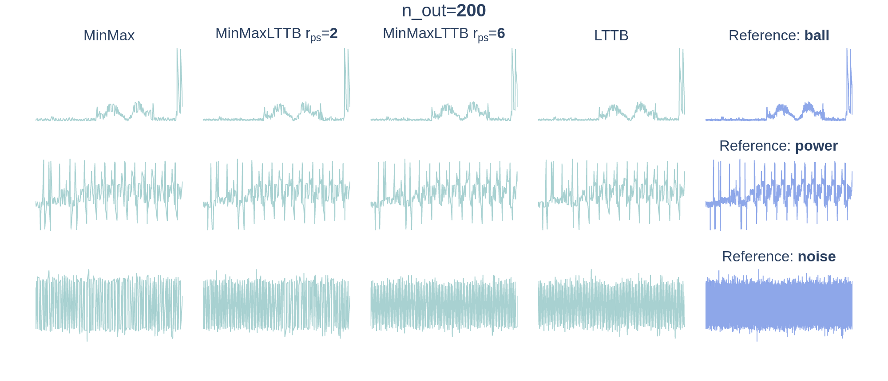
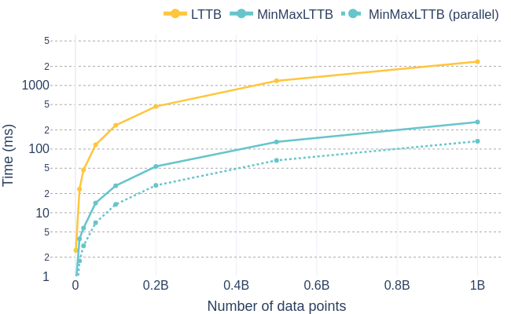

<div align="center">
<h1>:racehorse: <b>MinMaxLTTB</b>: Leveraging MinMax-Preselection to Scale LTTB </h1>
</div>

<div align="center">

<br></br>
</div>

*Codebase & further details for the paper*:  
> **MinMaxLTTB: Leveraging MinMax-Preselection to Scale LTTB**  
> Jeroen Van Der Donckt, Jonas Van Der Donckt

**Preprint**: https://arxiv.org/abs/2305.00332 - see [cite](#cite) for bibtex!

## Performance of `MinMaxLTTB`

The performance of `MinMaxLTTB` is assessed for single-core and multi-core execution of our implementation (see [`tsdownsample`](https://github.com/predict-idlab/tsdownsample)).
We compare `MinMaxLTTB` with the C implementation that has been used in [`plotly-resampler`](https://github.com/predict-idlab/plotly-resampler) `<= 0.8.3.2`.

<div align="center">

<br></br>
</div>

**insights**:
- `MinMaxLTTB` is up to 10x faster than the `LTTB` C implementation in the single-core setting.
- `MinMaxLTTB` is up to 30x faster than the `LTTB` C implementation in the multi-core setting.

These benchmarks are performed on a machine with the following CPU: Intel Xeon E5-2650 v2 (32) @ 3.400GHz.


## Visual Representativeness of `MinMaxLTTB`

The visual representativeness is assessed in accordance with https://arxiv.org/abs/2304.00900 

<div align="center">

<br></br>
</div>

**insights**:
- MinMaxLTTB does not degrade the visual representativeness of LTTB!
- A low MinMax-preselection ratio $r_{ps} \gt 2$ results in a high visual similarity to LTTB

---
## How is the repository structured?

- The codebase is located in the `agg_utils` (python scripts) and notebooks folder.
- Additional details can be found in markdown files in the `details` folder.
- Supplementary gifs are located in the `gifs` folder.
- See [notebooks README](notebooks/) for the more details.
  - The `0.*` notebooks contain data parsing and figure generation.
  - The `1.*` notebooks perform the core experiments (visual representativeness and performance benchmarks).
- The `animations` folder contains html animations, which allow to inspect the phenomena in more detail.

Folder structure
```txt
├── agg_utils          <- shared codebase for the notebooks
├── animations         <- html animations
├── details            <- additional details in README.md files
├── gifs               <- supplementary gifs
├── loc_data           <- local data folder 
└── notebooks          <- experiment notebooks see notebooks README.md
```


## How to install the requirements?

This repository uses [poetry](https://python-poetry.org/) as dependency manager.
A specification of the dependencies is provided in the [`pyproject.toml`](pyproject.toml) and [`poetry.lock`](poetry.lock) files.

You can install the dependencies in your Python environment by executing the following steps;
1. Install poetry: https://python-poetry.org/docs/#installation
2. Activate you poetry environment by calling `poetry shell`
3. Install the dependencies by calling `poetry install`

## Utilizing this repository

Make sure that you've extended the [path_conf.py](agg_utils/path_conf.py) file's hostname if statement with your machine's hostname and that you've configured the path to the UCR archive folder.

## Cite

**Preprint**: https://arxiv.org/abs/2305.00332

If you use or build upon this work, please cite us via:
```bibtex
@article{van2023minmaxlttb,
  title={MinMaxLTTB: Leveraging MinMax-Preselection to Scale LTTB},
  author={Van Der Donckt, Jeroen and Van Der Donckt, Jonas and Rademaker, Michael and Van Hoecke, Sofie},
  journal={arXiv preprint arXiv:2305.00332},
  year={2023}
}
```

---

<p align="center">
👤 <i>Jeroen & Jonas Van Der Donckt</i>
</p>
